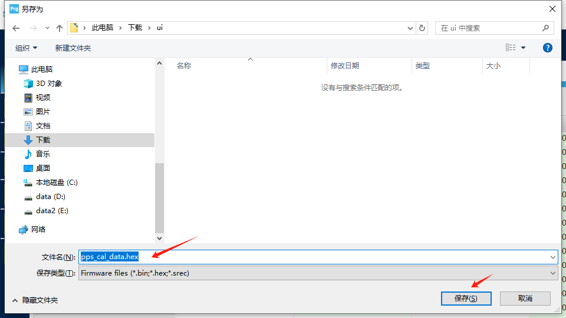

# M5Module-PPS-Internal-FW

## Overview

Contains Internal Firmware programs of M5Stack Module PPS.

## Note

**The last sector in STM32 stores calibration data. Modifying the content of this sector will make the module unable to function normally.**

## How to backup calibration data

1. Open STM32CubeProgrammer and use STLink to connect to Module PPS

2. Connect to Module PPS

3. Set the address to 0x08007800 and the size to 0x800

4. Save as hex file
   
   
   
   

## How to restore calibration data

1. Open STM32CubeProgrammer and use STLink to connect to Module PPS.

2. Connect to Module PPS

3. Chose hex file (Note that the address is 0x8007800 and the size is 2048 Bytes)

4. Cancel "Full chip erase"

5. Start Programming
   
   

## License

[M5Module-PPS-Internal-FW - MIT](LICENSE)